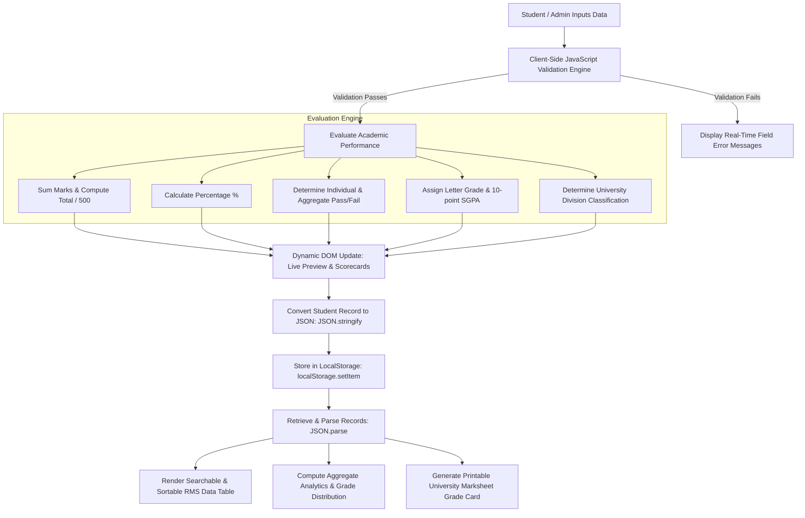

# StudentHub: Student Registration & Result Management System
### Master of Computer Applications (MCA) — Full Stack Web Development Coursework

---

## 📌 1. Project Overview
**StudentHub** is a responsive web application developed using **HTML5**, **CSS3**, and **JavaScript (ES6+)**. The system provides an academic registration and examination result evaluation portal designed with a vibrant **Orange Light Theme**.

### Objective
To implement an automated, responsive client-side student result management workflow:
1. **Student Registration**: Capture candidate academic details (Name, PRN/Roll Number, Email, Mobile, Programme, Semester, Gender) and subject scores.
2. **Client-Side Validation**: Validate candidate input via regular expressions (Regex) and bounds-checking (0–100 per course).
3. **Automated Academic Evaluation**: Dynamically calculate **Total Marks**, **Percentage**, **SGPA**, **Letter Grade** (O, A+, A, B+, B, C, F), **Pass/Fail status** (minimum 40 marks per course), and **University Division**.
4. **Dynamic DOM Manipulation**: Update live scorecards and render interactive data records in real-time.
5. **JSON Serialization & LocalStorage**: Convert student objects into JSON strings (`JSON.stringify()`) and persist them into the browser's `localStorage` for offline CRUD management.
6. **Result Management System (RMS)**: Filter, search, sort, edit, delete, and print official academic marksheets.

---

## 🏗️ 2. System Architecture & Data Flow



---

## 💻 3. Technology Stack

| Layer | Technology | Key Capabilities & Features Used |
| :--- | :--- | :--- |
| **Markup** | **HTML5** | Semantic tags (`<header>`, `<nav>`, `<main>`, `<section>`, `<article>`, `<footer>`, `<dialog>`), accessible forms, SVG vector icons, modern input types. |
| **Styling** | **CSS3** | Modern Orange Light Theme, CSS Custom Properties (Variables), Responsive CSS Grid & Flexbox, Card Shadows, Micro-interactions, and `@media print` rules for physical printing. |
| **Logic** | **JavaScript (ES6+)** | Strict mode, Pure functions, Arrow functions, Array methods (`filter`, `map`, `reduce`, `sort`), Event listeners, DOM manipulation, Regex validation. |
| **Persistence** | **Web Storage API & JSON** | `localStorage.getItem()`, `localStorage.setItem()`, `localStorage.removeItem()`, `JSON.stringify()`, `JSON.parse()`, `Blob` & `FileReader` for JSON file backup and restore. |

---

## 📊 4. Academic Grading & Evaluation Rules

The system follows standard university MCA guidelines (10-Point Grading System):

### Passing Criteria:
- **Individual Subject Passing**: Scored marks $\ge 40$ out of 100 in each of the 5 courses.
- **Aggregate Passing**: Overall percentage $\ge 40\%$.
- **Result Status**: If a student scores $< 40$ in even one subject, their status is evaluated as **FAIL** (Arrear).

### Grade Matrix:
| Percentage Range | Letter Grade | Grade Point | Academic Classification / Performance |
| :--- | :---: | :---: | :--- |
| **90% – 100%** | **O** | 10 | Outstanding |
| **80% – 89.99%** | **A+** | 9 | Excellent |
| **70% – 79.99%** | **A** | 8 | Very Good |
| **60% – 69.99%** | **B+** | 7 | Good |
| **50% – 59.99%** | **B** | 6 | Above Average |
| **40% – 49.99%** | **C** | 5 | Pass |
| **Below 40%** | **F** | 0 | Fail / Backlog |

### University Division Standards:
- **First Class with Distinction**: Percentage $\ge 75\%$ (with all subjects cleared)
- **First Class**: $60\% \le \text{Percentage} < 75\%$
- **Second Class**: $50\% \le \text{Percentage} < 60\%$
- **Pass Class**: $40\% \le \text{Percentage} < 50\%$
- **Fail**: Any subject $< 40$ or aggregate $< 40\%$

---

## 📂 5. File Structure

```text
Full Stack Assignment/
├── index.html        # Semantic HTML5 markup, dashboard, form, tables & marksheet modal
├── style.css         # Modern Orange Light Theme CSS3 stylesheet, tokens, animations & print layout
├── app.js            # Modular JavaScript: validation, evaluation, LocalStorage & UI handlers
└── README.md         # Comprehensive project documentation & viva examination guide
```

---

## 🚀 6. Core Features & User Workflows

### 1. Student Registration & Marks Entry Form
- Input fields for student information with real-time format validation:
  - **Full Name**: Alphabetical format, min 3 characters.
  - **PRN / Roll Number**: Alphanumeric format, uniqueness checked against stored database.
  - **Email Address**: Verified via standard RFC-compliant regex pattern.
  - **Mobile Number**: 10-digit numeric validation.
  - **Programme Selection**: Master of Computer Applications (MCA), M.Sc CS, M.Tech SE, etc.
  - **Semester & Gender**: Dropdowns.
- **5 Core MCA Curriculum Courses**:
  1. `MCA-301`: Advanced Data Structures & Algorithms
  2. `MCA-302`: Database Management & NoSQL Systems
  3. `MCA-303`: Web Technologies & Full Stack Dev
  4. `MCA-304`: Software Engineering & Cloud Computing
  5. `MCA-305`: Python Programming & Machine Learning
- **Live Interactive Preview**: As user enters marks, JavaScript calculates Total, Percentage, SGPA, Division, and displays a dynamic preview of the JSON payload.

### 2. Result Management Database (RMS Table)
- Displays registered candidates in a responsive, clean data table.
- **Instant Search**: By candidate name, roll number, or email.
- **Multi-Filter**: Filter by Pass / Fail status, or by enrolled academic programme.
- **Multi-Criteria Sorting**: Sort by percentage (high to low / low to high), roll number, student name (A-Z), or date created.
- **Actions**:
  - 👁️ **View Marksheet**: Opens official printable grade card dialog.
  - ✏️ **Edit Record**: Populates form, allows modifications, updates LocalStorage.
  - 🗑️ **Delete Record**: Prompts modal confirmation before safe deletion.

### 3. Official University Marksheet Modal & Print Layout
- Displays an authentic, college-standard marksheet with university seals and department headers.
- Lists all courses, credits, maximum marks, minimum passing marks, marks scored, and individual grades.
- Shows total aggregate score, semester SGPA, division, and an official Pass/Fail seal.
- Features **Print Marksheet** (`window.print()`) styled via `@media print` to print directly onto standard A4 paper.

### 4. Analytics & Performance Dashboard
- **KPI Summary Banner**: Real-time counter cards for Total Registered Students, Pass Percentage %, Class Average %, and Top Scorer Spotlight.
- **Grade Distribution Chart**: Visual progress bars showing distribution across O, A+, A, B+, B, C, F bands.
- **Programme Comparison**: Passing rates and mean scores across branches.
- **Subject Difficulty Metrics**: Average marks secured across each individual course.

### 5. LocalStorage & JSON Data Management
- **JSON Serialization**: Students are stored as a JSON array under the key `studenthub_records_v1`.
- **Export to JSON**: One-click download of all records as a `.json` backup file.
- **Import from JSON**: Upload and merge JSON data files using the JavaScript `FileReader` API.
- Starts completely clean and empty ready for real student registrations.

---

## 🏃 7. How to Run the Project

Since the project is built using native standard **HTML5**, **CSS3**, and **Vanilla JavaScript**, it requires **no installations, no dependencies, and no web servers**.

### Direct Browser Execution
1. Navigate to the project folder (`Full Stack Assignment/`).
2. Double-click [index.html](file:///Users/rushikesh/Documents/Full%20Stack%20Assignment/index.html) (or right-click $\rightarrow$ **Open With** $\rightarrow$ Google Chrome, Microsoft Edge, Mozilla Firefox, or Apple Safari).
3. The application will launch instantly and run entirely in your web browser with full `localStorage` persistence.

---

## 👨‍💻 Developed For
- **Application**: StudentHub
- **Course**: Master of Computer Applications (MCA)
- **Subject**: Full Stack Web Development Laboratory Assignment
- **Technologies**: HTML5 &bull; CSS3 &bull; JavaScript (ES6+) &bull; Web Storage API
